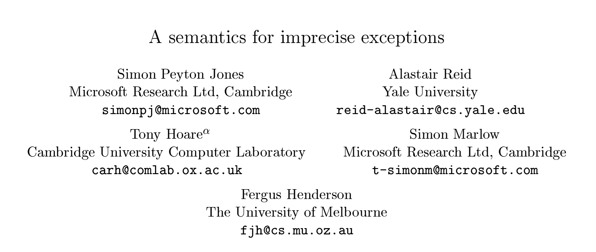

# Semantics

Note:

No one likes to argue about semantics.
But semantics are kind of important!
So let's define some terms real quick.


# error

## vs

# exception

Note:

As programmers, we often talk about "errors" and "exceptions".
The definition I've heard is that "an error is a *programmer* error," while an exception is a possible state that is so unlikely that we can't meaningfully consider it.

In both cases, we do *something* in our program that brings everything to a halt.
Since the *action* of signaling "something really bad happened" is the key idea here, I am going to use the words interchangeably.
As programmers it doesn't matter *why* we're throwing or catching exceptions.


# Semantics, really

Note:

OK, so that was "semantics as what words mean." 
Which is the kind of semantics that everyone hates.
So let's instead talk about the semantics of an exceptional value.


# boom!

```haskell
-- Haskell
undefined :: a
undefined = undefined
```

```c
// C
int undefined() {
    return undefined(); 
}
```

```java
// Java
public class Undefined {
    public static <A> void undefined() {
        return undefined();     
    }
}
```

Note:

All languages have a way to blow up at runtime.
Haskell, C, Java,  Ruby, Python, Elixir,


# boom!

```rust
// Rust
panic!("Oh no!")
```

```go
// Go
panic("Oh no!")
```

Note:

even Rust and Go, which claim to not have exceptions.
Languages either acknowledge this with an exception system, or they don't.
The hope is that, if you don't have a real exception system, you won't use it much.


# $\bot$

## (pronounced "bottom")

Note:

So, things can blow up at runtime, in any Turing complete language.
The simplest way is infinite recursion, or an infinite loop.
In the type theory, we call this thing "bottom."
It inhabits every single type.
If I can take infinitely long to return a value, I can return a value of whatever type you want.
This is what Haskell's `undefined` thing is.




Note:

Haskell did not always have exceptions.
It did have a way to crash the program with an error message, much like Rust and Go's panic.
This paper "A semantics for imprecise exceptions" introduced a meaning for exceptional values in Haskell.
I highly recommend reading this paper if you'd like more detail on this.


# Imprecise?

```haskell
-- Haskell
main :: IO ()
main = do
  let x = error "x" :: Int
  let y = error "y" :: Int
  print (x + y)
```

Note:

What does it mean for an exception to be imprecise?
Let's consider this Haskell program.
Which exception will be thrown first?
Will we see x printed out, or y?
Let's switch gears to a language with precise exceptions: Java!


# Precise!

```java
// Java
public class Boom {
    public static void main(String[] args) {
        int x = boom("x");
        int y = boom("y");
        System.out.println(x + y);
    }    

    static int boom(String str) {
        throw new Exception(str);
        return 0;
    }
}
```

Note:

When we're reading this code, we know exactly what will happen:
It will throw the x exception first, and never even get to the variable assignment for y.


# Imprecise!

```haskell
-- Haskell
main :: IO ()
main = do
  let x = error "x" :: Int
  let y = error "y" :: Int
  print (x + y)
```

Note:

Now, let's get our heads around imprecise exceptions.
Haskell is lazy.
So the first line, let x = error x, will bind the variable x to that expression, and it won't evaluate it.
The second line will do the same thing with y.
And finally, we pass x and y to print.
Which error is thrown?

Either!
We don't know *precisely* which error will be thrown.
We do know, imprecisely, that it could be one of the two errors in that set.
Haskell can choose to evaluate the two parameters to plus however it wants, and whichever it chooses first, that will be the one to throw the error.


# Anything can blow up

# At any point

# For any reason

welcome to programming

Note:

So any value in Haskell can be "bottom," and whenever the runtime ends up evaluating it, we get this exceptional value.
Which one?
Well, we can't know for sure!

Fortunately, while this sounds a little bleak, this is the same thing you'll get in any programming language.
At least we're not worse off than any other language.
Unless you want reasonable stack traces, which Haskell doesn't have.
