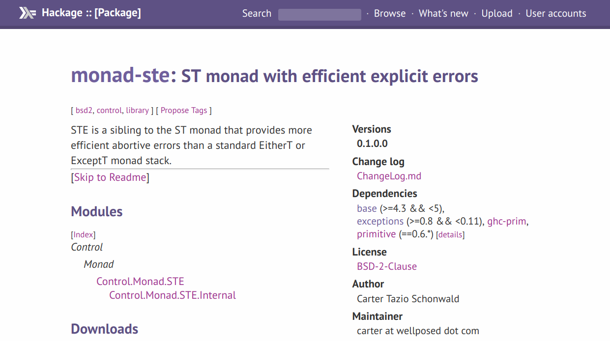

# Exceptional Semantics

Note:

Let's talk about the semantics of an exceptional value.
What does an exception mean, in our "theory of language"?


# boom!

```haskell
-- Haskell
undefined :: a
undefined = undefined
```

```java
// Java
public class Undefined {
    public static <A> A undefined() {
        return undefined();     
    }
}
```

Note:

All Turing complete languages have a way to blow up at runtime.
Haskell, C, Java,  Ruby, Python, Elixir, etc.
These snippets demonstrate an infinite recursion that promises to return a value of whatever type you want.
It's lying, of course -- it'll never terminate!


# $\bot$

## (pronounced "bottom")

Note:

In the type theory, we call this phenomenon "bottom."
And it's written with this weird symbol.
In lazy languages, it inhabits every single type.
If I can take infinitely long to return a value, I can return a value of whatever type you want.
This is what Haskell's `undefined` thing is.


Note:

Haskell did not always have exceptions.
It did have a way to crash the program with an error message, much like C, Rust, and Go's panic.
This paper "A semantics for imprecise exceptions" introduced a meaning for exceptional values in Haskell.
If you'd like more detail than what I'm going to cover, then I recommend reading the paper.


# Imprecise?

Note:

What does it mean for an exception to be imprecise?
Let's first consider a language with precise exceptions: Java.


# Precise!

```java
// Java
public class Boom {
    public static void main(String[] args) {
        int x = boom("x");
        int y = boom("y");
        System.out.println(x + y);
    }    

    static int boom(String str) {
        throw new Exception(str);
    }
}
```

Note:

When we're reading this code, we know exactly what will happen:
It will throw the x exception first, and never even get to the variable assignment for y.
We know this because Java is strict -- it must fully evaluate every statement before it may proceed to the next one.
This means that we know *precisely* what exception will be thrown.


# Imprecise!

```haskell
-- Haskell
main :: IO ()
main = do
    let x = error "x" :: Int
    let y = error "y" :: Int
    print (x + y)
```

Note:

Now, let's get our heads around imprecise exceptions.
Haskell is lazy.
So the first line, let x = error x, will bind the variable x to that expression, and it won't evaluate it.
The second line will do the same thing with y.
And finally, we pass x and y to print.
Which error is thrown?

Either!
We don't know *precisely* which error will be thrown.
We do know, imprecisely, that it could be one of the two errors in that set.
Haskell can choose to evaluate the two parameters to plus however it wants, and whichever it chooses first, that will be the one to throw the error.

If we try to force the evaluation order, then we ruin many good optimization passes, and make it more difficult to reason about our program equationally.
Instead, we say that Haskell expression can throw one of a set of exceptions.
When we combine Haskell expressions, we take the union of the sets of exceptions that might be thrown, and that's the new set.


# Anything can blow up

# At any point
<!-- .element: class="fragment" -->

# For any reason
<!-- .element: class="fragment" -->

welcome to programming
<!-- .element: class="fragment" -->

Note:

So any value in Haskell can be "bottom," and whenever the runtime ends up evaluating it, we might get the real value.
Or we might get an unpredictable choice from a set of exceptions that any subterm might have thrown.

While this sounds a little bleak, this isn't that far off from what you'll get in any programming language.
At least we're not worse off than any other language.
Unless, of course, you want reasonable stack traces, which we don't have.


# Why not use `Either`?

```haskell
data Either l r 
    = Left l 
    | Right r
```

Note:

So why don't we just use Either?
That's what Rust does, after all.
They don't have exceptions, and use Either just fine!


# Performance :\

```haskell
instance Monad (Either l) where
    return = Right
    ma >>= f =
        case ma of
            Left l -> 
                Left l
            Right r -> 
                f r
```

Note:

This is the monad instance for Haskell's either type.
At every single bind, we have to perform a `case` expression to figure out if we have a Left or a Right.
This ends up being pretty nasty on performance for tight loops and intense computations.
This renders it , and ExceptT, as unsuitable for many applications.




https://hackage.haskell.org/package/monad-ste

Note:

We can use the neat `monad-ste` package to have an explicit error type for short-circuiting without paying for the cost of an if at every bind.
It piggybacks on the ST machinery that GHC has, and does some tricky stuff with runtime exceptions to represent them in the types.
This gives us very fast pure typechecked exceptions.
