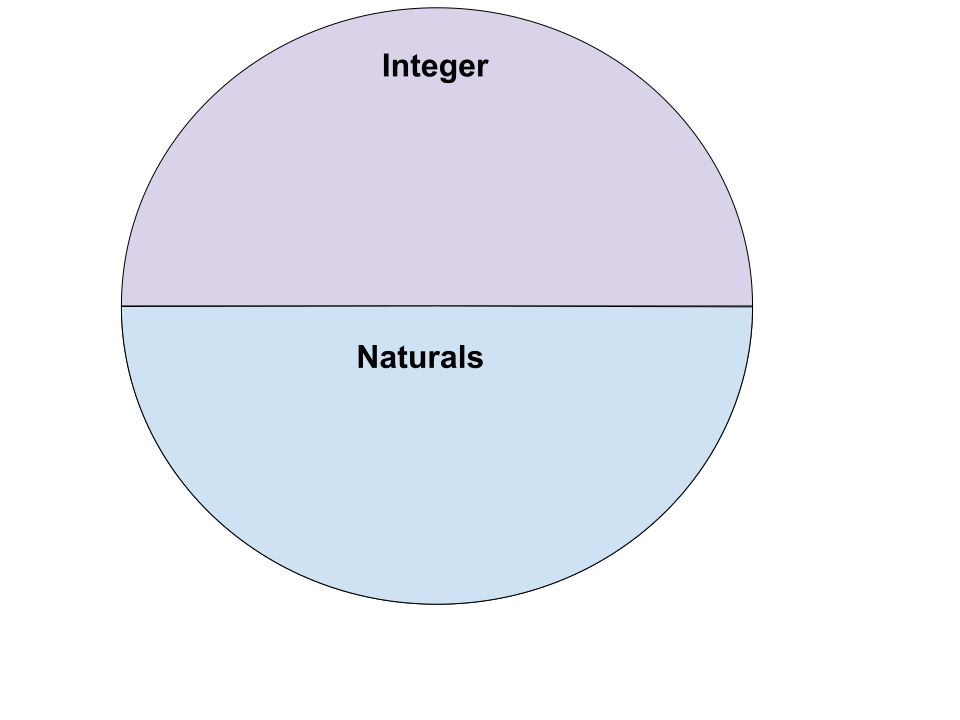

# Typed
# Checked
# Exceptions

Note:

On the other end of the tradeoffs, we have typed checked exceptions.
These are appealing, but have some interesting drawbacks.
We're going to cover some of those drawbacks and figure out how to work around them.


### "I want to know about *ALL* the exceptions my program might throw!"

```haskell
newtype App a = App
    { unApp :: ReaderT Config (ExceptT AppError IO) a 
    } deriving
    ( Functor, Applicative, Monad, MonadIO
    , MonadReader Config
    , MonadError AppError
    )

data AppError
    = Can'tFindThing ThingId
    | FailToOpenFoo FooId
    | SomeHttpException HttpException
    | TooMuchMoney Coin
    | InvalidTransaction Transaction
    | MySQLDied MySQLException
    | MongoDisagreed
    | SomeOtherThing SomeException
    | SoManyFailureCases
```
<!-- .element: class="fragment" -->

Note:

A common thought is that we want to know about *any* exception that a program might throw.
So, rather than use IO for exceptions, we use `ExceptT` in our monad stack, and we promise to only ever use ExceptT.
After a few months of development, it turns out there's a lot of error cases.
So we end up with this huge sum type of errors.

Not to mention that we're *still* debugging IO exceptions, because IO throws exceptions and there's no getting around that!
Given async exceptions, any value might blow up at any point from any thread.
Due to bottom, any value in Haskell might be an imprecise, synchronous exception.
The operating system might throw an out of memory exception at any point.
We can't meaningfully deal with *all* exceptions.
Furthermore, we don't really *want* to.
What can we do?


 <!-- .element: id="plain" -->

Note:

Well, let's drill down into what we mean with code!
Here, I've got a Venn diagram.
The big blue circle is the set of all strings of ASCII symbols.
This is literally any random bit of gibberish you might imagine.
And the smaller, green circle is the set of syntactically valid programs.
It's a lot smaller.


<!-- .element: id="plain" -->

Note:

When we zoom into that set of syntactically valid programs, we see that there are some more subsets.
There's a set of programs that type check, and another set of programs that actually work.
But, wait, let's zoom in on those a bit...


<!-- .element: id="plain" -->

Note:

OK, so the set's aren't totally overlapping.
A type system is going to rule out some programs that really do work.
We generally accept that this is an OK trade off, because it forbids vastly more programs that don't work.


<!-- .element: id="plain" -->

Note:

So lets talk about types.
A type is kinda/sorta like a means of classifying values.
Here's the type of Integer in Haskell.
We have 1, 2, negative 500, etc.
It's infinite! We have infinitely many integers.

Are the integers the right type for our problem?
Well, that depends on the problem.
Sometimes, having the full range of integers gives us too many values to represent our domain.



<!-- .element: id="plain" -->

Note:

Sometimes, we only want to talk about the naturals.
Natural numbers start with 0 and count up from there.
Negative numbers sometimes don't make sense.


```haskell
takeN :: Natural -> [a] -> [a]
takeI :: Integer -> [a] -> [a]

lengthN :: [a] -> Natural
lengthI :: [a] -> Integer
```

Note:

Consider these functions on lists: take and length.
If we give `take` a negative number, that doesn't really make any sense -- what does it mean to take negative four elements of a list?
We can "round" this to zero, but we can forbid a bizarre implementation entirely by using a more precise type.

Likewise, `length` could only ever return a `Natural` number.
There's no such thing as a list with negative length.
Returning an integer is losing that information.

The smaller types we can give things, the more we know about our programs, and the better we can understand and analyze them.


```haskell
data AppError
    = Can'tFindThing ThingId
    | FailToOpenFoo FooId
    | SomeHttpException HttpException
    | TooMuchMoney Coin
    | InvalidTransaction Transaction
    | MySQLDied MySQLException
    | MongoDisagreed
    | SomeOtherThing SomeException
    | SoManyFailureCases

findThing :: ThingId -> IO (Either AppError Thing)
```

Note:

Let's go back to our example from earlier.
We have this huge error type, representing anything that can go wrong.
But, `findThing` only has a single mode of failure: `Can'tFindThing`.
When we use `findThing`, perhaps we might like to catch that error.


```haskell
app :: IO ()
app = do
    ething <- findThing someThingId
    case ething of
        Left (Can'tFindThing thingId) ->
            putStrLn "Couldn't find thing"
            handleMissingThing thingId
        Left err ->
            putStrLn "Uh, this is technically impossible?"
        Right thing ->
            doStuffWith thing
```

Note:

We catch the error case.
We know the only real possibility is Can'tFindThing.
But we still must handle the other cases!
That is deeply annoying, in my opinion.
Let's see it in ExceptT:


```haskell
app :: App ()
app = do
    thing <- findThing someThingId
        `handleError` \err ->
            case err of
                Can'tFindThing thingId ->
                    pure defaultThing
                err ->
                    error "The impossible happened"
    
    doStuffWith thing
```

Note:

We can use the ExceptT functions to handle the specific exception.
But we havne't "really" handled it, according to the types -- there's nothing in the types that say that this isn't still a problem!


# Finer Errors

Note:

Let's use a bit of the advice I mentioned earlier: single constructor for error types.
Here's our new error type:


```haskell
data Can'tFindThing     = Can'tFindThing ThingId
data FailToOpenFoo      = FailToOpenFoo FooId
data TooMuchMoney       = TooMuchMoney Coin
data InvalidTransaction = InvalidTransaction Transaction
data MongoDisagreed     = MongoDisagreed

findThing 
    :: ThingId 
    -> ExceptT Can'tFindThing IO Thing
    
tooMuchMoney 
    :: AccountId 
    -> ExceptT TooMuchMoney IO Account
```

Note:

Nice! 
These are a lot simpler and we can be much more precise about the error conditions involved.
Unfortunately, there's a down side...
We can't easily compose these two functions.


```haskell
findThing 
    :: ThingId 
    -> ExceptT Can'tFindThing IO Thing
    
tooMuchMoney 
    :: AccountId 
    -> ExceptT TooMuchMoney IO Account

typeError thingId accountId = do
    thing <- findThing thingId
    account <- tooMuchMoney accountId
    pure (thing, account)
```

Note:

This doesn't work.
We get a type error because  Can'tFindThing and TooMuchMoney are different types.
This is due to the way Monad is implemented in Haskell.


```haskell
(>>=)
    :: m       a
    -> (a -> m b)
    -> m       b

-- specialized,

(>>=) 
    :: ExceptT       e m a
    -> (a -> ExceptT e m b)
    -> ExceptT       e m b
```

`e` can't change :(

Note:

The error type on `ExceptT` can't change if we want to use it in do notation.
So that's no good! 
In order to make that work, we'd need to introduce some additional polymorphism...


# Classy

# Prisms

Note:

A cool way to approach this is to use classy prisms.
If you're not familiar with lenses and optics, don't worry.
A prism gives you two things: A means of looking into a part of a value that might not be there, and a means of constructing a value given a part.

These actually work quite well for IO runtime exceptions, also!


```haskell
preview :: Prism s a -> s -> Maybe a

preview _Right (Left 3)  === Nothing
preview _Right (Right 3) === Just 3

review  :: Prism s a -> a -> s

review _Right 3 === Right 3
review _Left 2  === Left 2
```

Note:

This is expressed by these two functions: preview and review.
Preview gives you a chance to "see" into the value.
Review gives you the ability to construct a value using a piece.
This works for stuff like Either.


```haskell
class AsTooMuchMoney e where
    _TooMuchMoney :: Prism e TooMuchMoney

instance AsTooMuchMoney TooMuchMoney where
    _TooMuchMoney = id

mkTooMuchMoney    
    :: AsTooMuchMoney e => TooMuchMoney -> e
mkTooMuchMoney = review _TooMuchMoney 

maybeTooMuchMoney 
    :: AsTooMuchMoney e => e -> Maybe TooMuchMoney
maybeTooMuchMoney = preview _TooMuchMoney
```

Note:

As far a we're concerned, this is what a classy prism looks like.
It gives us a way to "project" a `TooMuchMoney` into some polymorphic type.
It also gives us a way to check a value that's an instance of the type class, and maybe get the `TooMuchMoney` out of it.

This lets us do something pretty neat:


```haskell
findThing
    :: (AsCan'tFindThing e)
    => ThingId -> ExceptT e IO Thing
findThing thingId = do
    -- ...
    case mthing of
        Nothing -> 
            throwError (review _Can'tFindThing thingId)
        Just thing -> 
            pure thing

tooMuchMoney
    :: (AsTooMuchMoney e)
    => AccountId -> ExceptT e IO Account
tooMuchMoney accountId = do
    -- ...
    if money > theLimit
        then throwError (review _TooMuchMoney money)
        else pure account
```

Note:

Now, instead of saying that we're throwing any app error at all, we remain polymorphic in the error we throw, provided that the type *you* choose can be interpreted as a Can'tFindThing or a tooMuchMoney.
We don't just throw the error directly: instead, we use the classy prism to project it into this polymorphic type.
Will it compose?


```haskell
findThing
    :: (AsCan'tFindThing e)
    => ThingId -> ExceptT e IO Thing

tooMuchMoney
    :: (AsTooMuchMoney e)
    => AccountId -> ExceptT e IO Account

combined
    :: (AsTooMuchMoney e, AsCan'tFindThing e)
    => AccountId -> ThingId -> ExceptT e IO ()
combined accountId thingId = do
    thing <- findThing thingId
    account <- tooMuchMoney accountId
    print (thing, account)
```

Note:

Yes! It does compose!
We collect the two constraints on our type variables.
This "just works".
It allows us to express our errors as fine-grained as we want.
And errors compose together just fine.


# unfortunately

# :(

Note:

Unfortunately...
This only solves half of the problem with a giant error type.
Remember the Venn diagrams we had?
The problem we ran into is that our type was too big!


<!-- .element: id="plain" -->

Note:

This is our big AppError type from earlier.
It has a bunch of different error cases.
Ultimately, our app will "concretize" to this.
And, as we collect constraints from individual functions, they only ever get bigger.
There's no way to eliminate them.


<!-- .element: id="plain" -->

Note:

What we really want is a way to say:
AppError is a collection of various types of exceptions.
We can add a type to it...
And we can REMOVE types from it, too.


<!-- .element: id="plain" -->

Note:

Here, we've caught some exception types, and handled them, and we know they're not coming back.
Eventually, we've handled all the application errors, and we *know* that we've done so.
We really want to be able to do this.
If we only ever *grow* the amount of exceptions we can face, and we can't ever reduce it,
then we might as well be programming against dynamically typed, unchecked exceptions.


# Wishlist

1. Composable
2. Growable
3. Shrinkable
4. Fast

Note:

ExceptT with classy prisms gives us composability and growability.
But we can't shrink, and it's slow.


Note:

There's a PureScript library called `purescript-checked-exceptions` that leverages PureScript's row polymorphism heavily to provide basically all of this.
Unfortunately, my attempts to port this library to Haskell have all failed.
I was hoping to debut a library to solve this today, but it might be beyond what Haskell can do.
