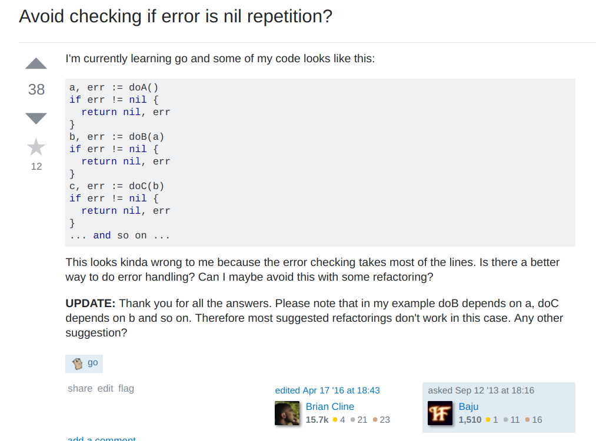

# boom!

<!-- .slide: data-background="explosion.jpg" -->

Note:

I don't know about you, but whenever I think of exceptions, this is what comes to mind.
Everything blowing up and being terrible.
It's not fun at all to be running some service in production, and *boom* an exception brings everything to a halt.
As bad as this language feature is, there must not be very many languages that support it.


# Languages with Exceptions

- Java
<!-- .element: class="fragment" -->
- Scala
<!-- .element: class="fragment" -->
- Haskell
<!-- .element: class="fragment" -->
- F#
<!-- .element: class="fragment" -->
- Ocaml
<!-- .element: class="fragment" -->
- Standard ML
<!-- .element: class="fragment" -->
- Ruby
<!-- .element: class="fragment" -->
- Python
<!-- .element: class="fragment" -->
- JavaScript
<!-- .element: class="fragment" -->
- Etc...
<!-- .element: class="fragment" -->

Note:

So let's look at some languages that have this backwards feature.

Java has them. As does Scala, and Haskell.
Turns out, a lot of languages have exceptions.
The list kinda, just goes on.


## Langauges 

# WITHOUT 

## exceptions

Note:

Maybe it's better to talk about which languages don't have exceptions?
There are a few that we talk about a lot in today's programming world.
I'm going to highlight two:


Note:

C does not have exceptions.


Note:

And this adorable little gopher does not know how to deal with exceptions either.


Note:

So, this is weird.
As programmers, we're used to dealing with tools that are painful and bad.
But if we dislike exceptions so much, why do so many languages have them?

Having exceptions turns out to be nicer than *not* having exceptions.


# boom!

<!-- .slide: data-background="explosion.jpg" -->

Note:

There's no escaping it.
We're programming computers.
They will blow up at any time for any reason and bring your entire program down.
Exceptions give us a way of talking about this failure and handling it in the language.
As well as causing that failure, when we're feeling cheeky.


# C

```c
#include <stdlib.h>

int main() {
    exit(1);    
}
```

Note:

In C, we can call the exit procedure, which will abort the program entirely right then.
Or you can do a segfault, which ends things pretty quickly too.
There's also panic, which kills the whole thing.


# Go

```go
func main() {
        panic("Oh no!")
}
```

Note:

And, of course, Go can panic too.
Like Rust, it has a mechanism to recover from panics, but the documentation seems to strongly recommend against using it, and it uses some weird deferred function stuff that frankly confused me.


# Error Handling

```c
// C
thing * result = (thing *) malloc(sizeof(thing));

int code = do_something(result);

if (code != MY_SUCCESS_CODE) {
    // handle error...    
}

// use result
```

Note:

Let's check out some error handling code when you don't have exceptions.
This is some fairly typical C code that does error handling.
If a procedure can have an error, you don't return the "value" from the function.
You return an error code, and you expect that the client passes in a pointer that will contain the actual return value.
The client must check the error code, and handle errors if the call isn't successful.
If the call is successful, then you use the modified or mutated result value.


# Error Handling



Note:

Go uses a different convention, where functions that might have errors return a tuple on the error and the return value.
You're supposed to check if the error is not nil.
If the error is present, then you need to handle it.
Otherwise, you continue on your merry way.


# Not

# Ideal

Note:

So, handling errors is pretty clumsy if you don't have exceptions.
We're not even getting into Posix signals, which can occur at any time at any point in your codebase, and are typically very awkward to handle.
Let's try to understand exceptions a bit better -- maybe it'll help me appreciate them more.
